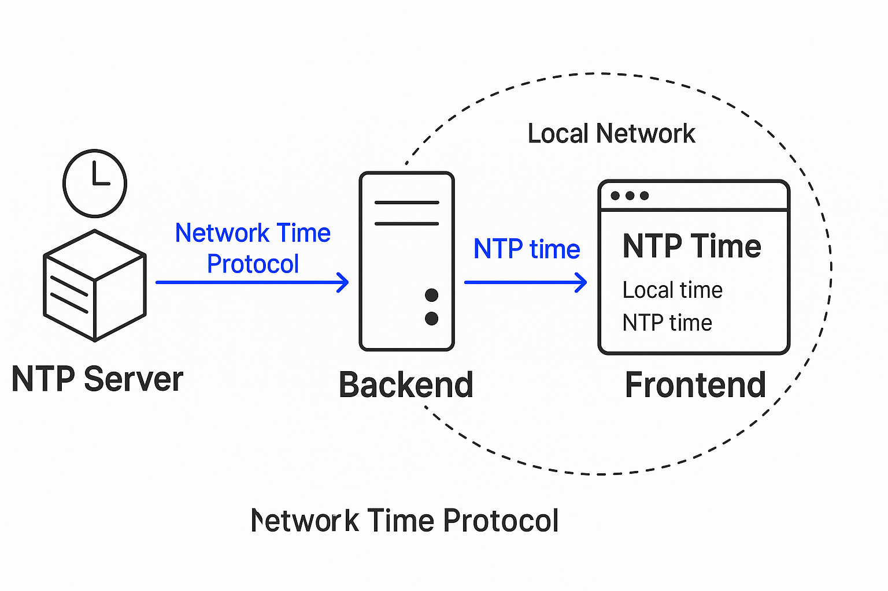

# ✅ NTP Server with Docker and API Bridge (With Bearer Token Auth)



This project demonstrates how to run an NTP server inside Docker and create a secure Express.js API bridge with Bearer Token authentication. It allows access to NTP time from a browser or JavaScript client, ensuring accurate and tamper-proof time synchronization that doesn't rely on the local system clock.

---

## 🧰 Prerequisites
- Docker & Docker Compose
- Node.js & npm installed
- Basic understanding of Express.js and environment variables

---

## 🚀 Setup Instructions

### 1. Clone the Repository
```bash
git clone https://github.com/Muhammad-Ikhwan-Fathulloh/Network-Time-Protocol.git
cd Network-Time-Protocol
```

---

## 🐳 Running the NTP Server
```bash
docker-compose up -d --build
```

This will start the NTP server container listening on port 123.

---

## 🌐 Setting Up the Express.js API Bridge

### a. Create the API Directory & Install Dependencies
```bash
mkdir ntp-api && cd ntp-api
npm init -y
npm install express ntp-client moment-timezone cors dotenv
```

---

### b. Create `.env` File
```env
API_TOKEN=your-secret-token
```

> Replace `your-secret-token` with your actual API token.

---

### c. Create `server.js`

```js
// server.js
const express = require('express');
const ntpClient = require('ntp-client');
const cors = require('cors');
const moment = require('moment-timezone');
const dotenv = require('dotenv');

dotenv.config();

const app = express();
const port = 3000;
const API_TOKEN = process.env.API_TOKEN;

app.use(cors());

app.get('/api/ntp-time', (req, res) => {
  const authHeader = req.headers['authorization'];
  if (!authHeader || authHeader !== `Bearer ${API_TOKEN}`) {
    return res.status(401).json({ error: 'Unauthorized' });
  }

  const timezone = req.query.timezone || 'UTC';

  ntpClient.getNetworkTime("127.0.0.1", 123, (err, date) => {
    if (err) {
      return res.status(500).json({ error: 'Failed to retrieve time from NTP server' });
    }

    const converted = moment(date).tz(timezone);
    const dateOnly = converted.format('YYYY-MM-DD');
    const timeOnly = converted.format('HH:mm:ss');

    res.json({ date: dateOnly, time: timeOnly });
  });
});

app.listen(port, () => {
  console.log(`API Server running at http://localhost:${port}`);
});
```

---

### d. Start the API Server
```bash
node server.js
```

---

## 🧪 Testing the API from a JavaScript Client

### Create `index.html`
```html
<!DOCTYPE html>
<html lang="en">
<head>
  <meta charset="UTF-8">
  <title>NTP Time Test</title>
</head>
<body>
  <h1>NTP Time</h1>
  <p id="ntp-date">Loading date...</p>
  <p id="ntp-time">Loading time...</p>

  <script>
    async function fetchNTPTime() {
      const timezone = Intl.DateTimeFormat().resolvedOptions().timeZone;

      const response = await fetch(`http://localhost:3000/api/ntp-time?timezone=${timezone}`, {
        headers: {
          'Authorization': 'Bearer your-secret-token' // Replace with your actual token
        }
      });

      if (!response.ok) {
        const err = await response.json();
        document.getElementById('ntp-date').innerText = `Error: ${err.error}`;
        document.getElementById('ntp-time').innerText = '';
        return;
      }

      const data = await response.json();
      document.getElementById('ntp-date').innerText = `Date: ${data.date}`;
      document.getElementById('ntp-time').innerText = `Time: ${data.time}`;
    }

    fetchNTPTime();
  </script>
</body>
</html>
```

> ⚠️ In production, avoid hardcoding tokens in client-side code. Implement proper authentication.

---

## 🌍 DNS Configuration

If deploying publicly, point your domain’s A record (e.g., `ntp.domain.com`) to your API server’s public IP.

---

## 📡 API Endpoint

### `GET /api/ntp-time`

**Headers:**
- `Authorization: Bearer your-secret-token`

**Query Parameters:**
- `timezone`: Optional, e.g. `Asia/Jakarta`, `UTC`, etc.

**Example Request:**
```
GET http://localhost:3000/api/ntp-time?timezone=Asia/Jakarta
Authorization: Bearer your-secret-token
```

**Example Response:**
```json
{
  "date": "2025-04-16",
  "time": "19:45:12"
}
```

---

## 📝 License

This project is licensed under the MIT License. See the [LICENSE](LICENSE) file for details.

---

Feel free to ask questions, create issues, or contribute to improve this project! Let me know if you also want this setup to support HTTPS or integrate with a frontend framework.